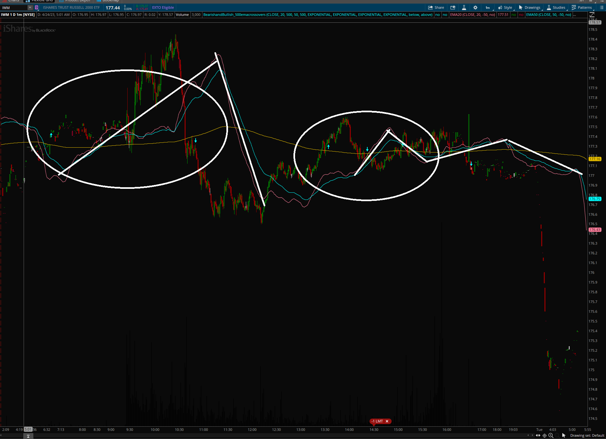

# 20cross500-mavg-indicators

Also Known As TITAN CROSSOVER

This is the 50 cross 500 and 20 cross 500 bull to bear switch indicator set for ThinkOrSwim made for Trent Titan of TitanTrades.
## Usage
To use this just add the study/indicator script to your thinkorswim and then add it to your chart.
In order to see the moving averages please use the Install with Moving Agerages chart style.
### Install
Open this shared item: 
#### Install with Moving Averages
Option this shared item: 
##### Notes
Some prefer the indicator lined up with the chart, you can remove the displacement on the indicators to make it a non-leading indicator if you wish. The standard is to draw the indicators before the candles to estimate the moving average convergences and divergences.
I set displacement to -50 so you need 50 bars extension to the right to use the indicator with the leading function.
This is likely not going to work for all time frames, however I did find it useful at 1m-15m intervals and on the daily chart.
###### Contact Me
You can find me on Discord in the BullyBears Discord along with other ThinkOrSwim resources: 
